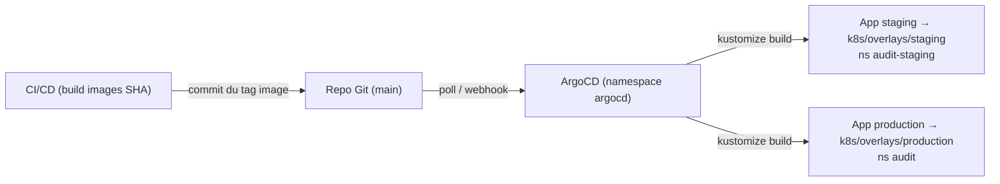

# GitOps — ArgoCD (SISAR Audit)

ArgoCD synchronise **automatiquement** le cluster k3s avec le repo Git :
toute modification de `k8s/overlays/*` (ou d'une image) déclenche la
synchronisation, avec **auto-heal** (aucune dérive possible) et **rollback**
intégré.

## Architecture



## 1. Installation (sur le nœud k3s)

```bash
make argocd:install   # = bash argocd/install.sh (manifests officiels)
make argocd:password  # mot de passe admin initial
# UI : kubectl port-forward -n argocd svc/argocd-server 8080:443 → http://localhost:8080
```

## 2. Déclarer le dépôt (si privé)

```bash
kubectl apply -n argocd -f argocd/repo-secret.yaml   # adapter le fichier d'exemple
```

## 3. Déployer les applications GitOps

```bash
make argocd:apps   # = kubectl apply project.yaml + app-of-apps.yaml
```

`audit-apps` (app-of-apps) déploie alors automatiquement `audit-staging` et
`audit-production`. Suivi :

```bash
argocd app list
argocd app sync audit-staging
argocd app get audit-production
```

## ⚠️ Secrets — à faire AVANT de synchroniser un vrai environnement

- `k8s/base/secrets.yaml` ne contient que des **placeholders** (`CHANGE_ME`) :
  ne PAS le laisser tel quel en production.
- **Recommandation GitOps : SealedSecrets** (voir `argocd/sealed-secrets/example.yaml`).
  Chiffrez les secrets avec `kubeseal`, committez le SealedSecret, et retirez
  `secrets.yaml` de la base (ou remplacez-le par un `secretGenerator`).
- Alternative simple : créer les secrets **hors bande** dans chaque namespace
  (`kubectl create secret ...`), et ne pas les versionner.

## 4. Intégration avec le CD (deploy.yml)

En mode GitOps, le job de déploiement ne fait **plus** `kubectl apply` : il met
à jour le tag d'image dans l'overlay et **pousse le commit** — ArgoCD synchronise.

```bash
# Au lieu de : kubectl apply -k k8s/overlays/<env>
cd k8s/overlays/<env>
kustomize edit set image audit-api=$IMAGE_PREFIX/audit-api:$SHA
kustomize edit set image audit-web=$IMAGE_PREFIX/audit-web:$SHA
git add . && git commit -m "chore(deploy): images $SHA" && git push
```

> Nécessite un **PAT** (secret GitHub `GITOPS_PAT`) avec les droits d'écriture
> sur le repo. À ajouter dans `.github/workflows/deploy.yml` (étape Git checkout
> avec `token: ${{ secrets.GITOPS_PAT }}`).

## 5. Rollback

```bash
# ArgoCD garde l'historique des syncs :
argocd app rollback audit-production <history-id>
# Ou Git : revert du commit (ArgoCD re-synchronise automatiquement).
```

## 6. Optionnel — Image Updater (mise à jour auto des images)

Pour détecter automatiquement les nouvelles images poussées sur GHCR (sans
commit) : installer `argocd-image-updater` et annoter les Deployments
(`argocd-image-updater.argoproj.io/image-list`). Voir la doc officielle ArgoCD.
