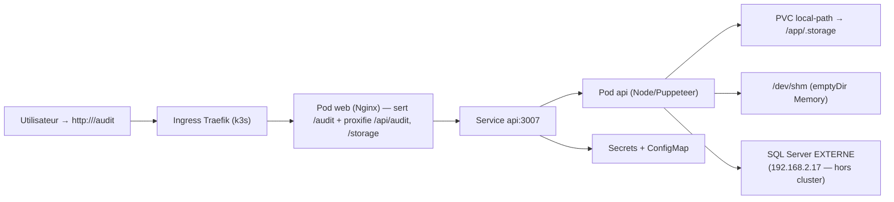

# Kubernetes (k3s) — SISAR Audit

Déploiement de l'application Audit sur un cluster **k3s** (1 nœud). La base
SQL Server reste **EXTERNE** au cluster (comme `docker-compose.external-db.yml`).

## Architecture



> Le pod **web** est l'entrée unique : son Nginx sert le frontend sous `/audit/`
> ET proxifie `/api/audit` + `/storage` vers le Service `api:3007` — exactement
> le même comportement que `docker-compose`. C'est pourquoi l'Ingress route tout
> vers `web:80`.

## Prérequis

- Un cluster **k3s** opérationnel (`curl -sfL https://get.k3s.io | sh -`)
- `kubectl` (déjà fourni par k3s)
- Les images `audit-api` et `audit-web` construites

## 1. Charger les images dans k3s

Les images locales ne sont pas dans un registry : on les importe directement.

```bash
# Construire (comme d'habitude)
docker build -f Dockerfile.api -t audit-api:1.0.0 .
docker build -f Dockerfile.web -t audit-web:1.0.0 .

# Importer dans k3s (mono-nœud)
docker save audit-api:1.0.0 | sudo k3s ctr images import -
docker save audit-web:1.0.0 | sudo k3s ctr images import -
```

> Variante minikube : `minikube image load audit-api:1.0.0 audit-web:1.0.0`

## 2. Configurer les secrets

```bash
# Éditer k8s/secrets.yaml et renseigner les vraies valeurs :
#   - DATABASE_URL (utiliser l'IP, pas le nom NetBIOS)
#   - JWT_SECRET, BOOTSTRAP_ADMIN_PASSWORD
#   - GEMINI_API_KEY / GLPI / SMTP si utilisés
```

## 3. Déployer

```bash
make k8s:apply        # kubectl apply -k k8s/
make k8s:status       # kubectl get pods,svc,ingress -n audit

# Suivi des pods
kubectl logs -n audit -f deployment/api
kubectl logs -n audit -f deployment/web
```

## 4. Accéder à l'application

```bash
# IP du nœud (traefik expose le port 80)
# → http://<IP-DU-NOeUD>/audit

# En dev (sans Ingress externe) :
kubectl port-forward -n audit svc/web 8080:80
# → http://localhost:8080/audit
```

## Notes importantes

- **Service `api` : le nom est OBLIGATOIRE.** Le Nginx du pod web proxifie vers
  `http://api:3007` — si vous renommez le Service, le frontend ne joindra plus l'API.
- **Base externe** : le cluster ne résout pas les noms NetBIOS/AD
  (`DLADIR2017`) → mettre l'IP (`192.168.2.17`) dans `DATABASE_URL`.
  Si la base est derrière un pare-feu, autoriser l'IP du nœud k3s.
- **Stockage** : `storageClassName: local-path` = disque du nœud k3s (mono-nœud).
  Pour plusieurs nœuds, remplacer par un stockage partagé (NFS, Longhorn…).
- **Replicas** : `replicas: 1` pour API et web. Pour le scaling horizontal,
  passer à 2+ (attention au stockage RWO et aux cron/PDF partagés).
- **`imagePullPolicy: IfNotPresent`** : images importées localement.
- Le typecheck frontend web (`tsc`) n'est pas intégré au pipeline : erreurs TS
  préexistantes (voir `k8s/../apps/web`).

## Évolution vers Helm

Les manifests actuels suffisent pour k3s mono-nœud. Si vous voulez gérer les
versions / environnements (dev/staging/prod) proprement, on peut encapsuler ce
déploiement dans un **Helm chart** (`audit-chart/`) avec `values.yaml`.

---

## CD — Déploiement continu (GitHub Actions + kustomize overlays)

### Principe
- **Images immuables** taguées par le **SHA du commit** (jamais `latest` en prod).
- **Environnements as-code** : `k8s/overlays/staging` et `k8s/overlays/production`
  (namespaces isolés `audit-staging` / `audit`).
- Workflow `.github/workflows/deploy.yml` :
  - **push sur `main`** → déploie **staging**
  - **tag `v*`** (ex: `v1.2.0`) → déploie **production** (ajoutez des required
    reviewers sur l'environnement GitHub "production" pour un garde-fou humain)

### Prérequis (secrets GitHub + cluster)
1. **KUBECONFIG** (secret du repo) : kubeconfig du cluster k3s, en base64.
2. **Registre** : le workflow pousse vers **GHCR** (`ghcr.io/<owner>/audit-api`).
   Remplacer `CHANGE_ME` dans les overlays par votre owner/organisation, ou
   adapter le workflow si vous utilisez un registre interne (Nexus/Artifactory).
3. **Secret de pull** dans le cluster (chaque namespace cible) :
   ```bash
   kubectl create secret docker-registry ghcr-pull \
     --docker-server=ghcr.io \
     --docker-username=<github-user> \
     --docker-password=<GITHUB_TOKEN> \
     -n audit-staging
   kubectl create secret docker-registry ghcr-pull \
     --docker-server=ghcr.io \
     --docker-username=<github-user> \
     --docker-password=<GITHUB_TOKEN> \
     -n audit
   ```
4. **Réseau** : le cluster doit pouvoir joindre `ghcr.io` (exception pare-feu
   nécessaire, comme pour npmjs — cf. contrainte FortiGate).

> **Variante on-prem sans registre externe** : sur le nœud k3s,
> `docker save <image> | k3s ctr images import -` puis
> `kubectl apply -k k8s/overlays/<env>` avec des tags locaux (modèle déjà utilisé
> en mono-nœud). Le workflow Jenkins peut porter cette logique.

### Rollback
- Les images restent dans le registre taguées par SHA → **revenir en arrière =
  re-déployer l'ancien SHA** :
  ```bash
  # Rollback immédiat (dernier état connu)
  kubectl rollout undo deployment/api -n audit
  # Ou re-déployer une image précise
  kustomize edit set image audit-api=ghcr.io/<owner>/audit-api:<ancien-SHA>
  kubectl apply -k k8s/overlays/production
  ```
- Git : un revert du commit déclenche à nouveau le CD (images réutilisées).
